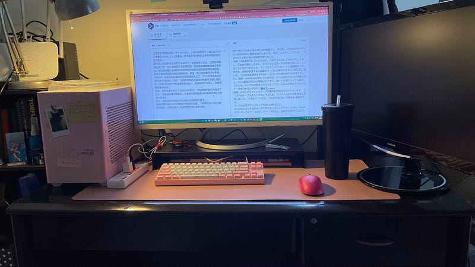

## RTX3090放入NR200P實測\_2022.10.22

九月底十月初的時候入手了RTX3090，之後又陸續買了一個32G DDR4記憶體和1000W SFX-L的電源。昨天終於有時間將這些零件測試並且進行安裝。  
雖然晚上六點多就已經差不多裝好了，也開機做了測試。但是後來直播結束之後，我才發現顯示卡非常的燙。因為我的線直接接觸在背版上，所以我很擔心這樣的高溫會讓我的線材在長時間使用後被毀損。我想了很多種組合來解決這種狀況。最後，我只能放棄將3090放進NR200P。理由是因為機殼內的空間真的太小了，SFX-L的電源真的比原本的SFX電源大了很多，無論我用橫向或縱向的將顯示卡放入機殼中，都會因為線材的關係導致無法放入，或是雖然可以放入，但是他存在著危險性。  
最後，我保有原本的CPU和顯示卡的配對，然後把原本的水冷改成了空冷，讓裡面的線材最簡化。小型機殼果然還是只能選擇這樣的方案會比較安全。安裝完成時已經是深夜12點了，有些事情都還沒做…  
此外，我也順便把機殼內的灰塵和桌面整理完畢了。之前地上的一些死角也趁這次的移動，將這些地方打掃乾淨。但地上還是放置了很多我拿出來進行測試的零件，要慢慢把他們收好。  
目前我還在想RTX3090要進行什麼樣的配置。可能要換成ATX的主機板和機殼，空間比較大，散熱可能也會比較好處理。

目前電腦的配置如下，和實驗室的配置一樣。只是兩個螢幕都太大了，目前的桌面一直沒有辦法放雙螢幕。

