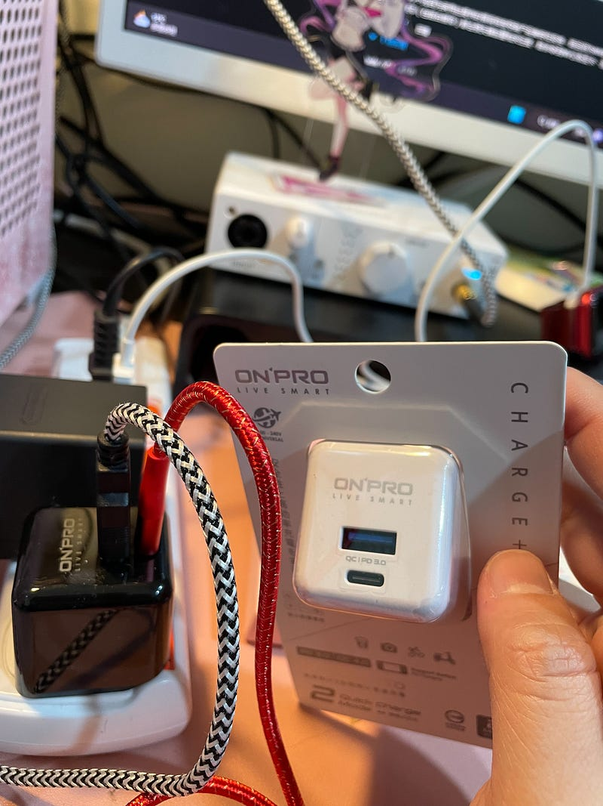
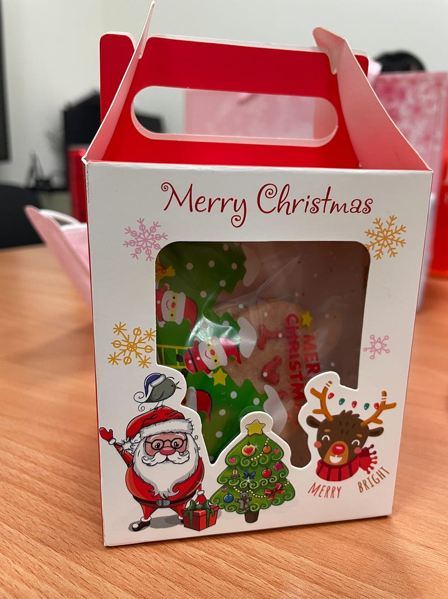
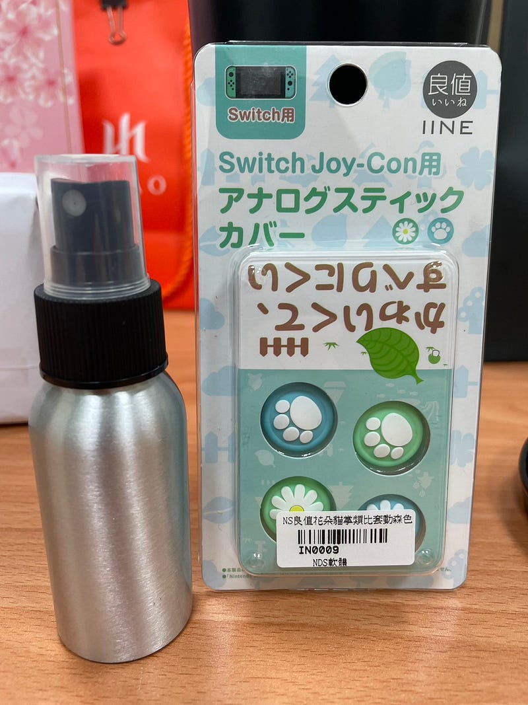

今年同事說想要玩交換禮物時，其實我也不知道為什麼非常排斥，並且也不像他們很期待。  
直到昨天我也很困惑為什麼我會有這種反應。

我們進行的交換禮物規則是每個人都要準備兩份禮物。一份禮物是好的禮物（必須要買新的），一份禮物是壞的禮物（可以是自己不需要用到的物品，但不能是垃圾） 。  
我並不排斥準備禮物，但是因為要看參與的人有哪些人，並且考量每個人的喜好及需求，所以我覺得準備這份禮物的難度有點高。  
此外，因為上次我收到一個沒有功能性，只有趣味性的禮物，對於這個禮物的處理，我也覺得很困難。因為缺乏功能性，我幾乎用不到，丟棄了又覺得很可惜。可能是因為這樣的原因所以不喜歡這種大人數的交換禮物吧？  
後來好的禮物我準備了USB充電插座，壞的禮物我準備了出差時去出差的地點買的餅乾禮盒。  
我還是希望收到壞的禮物的人能夠開心，餅乾禮盒是去出差的醫院的病人做的餅乾。之前出差時我都會買他們的產品。他們經過訓練之後，做出來的甜點都很好吃。  
好的禮物用了盒子和包裝紙包了起來。

我準備的好的禮物

我準備的壞的禮物

在抽禮物前，我們決定好的禮物抽完之後，在拆封之前都可以和其他人交換。  
今年我抽到分別跟我關係很好的前輩（壞的禮物）跟後輩（好的禮物）的禮物。好的禮物因為沒有封的很緊密，所以我有聞到香味，並且我推測可能是還不錯的化妝品，所以就跟前輩提出交換了。主要是我每次都會忘記使用，但是前輩是會使用化妝品的，所以我認為比起我收到，或許這些禮物更適合前輩。後輩的好的禮物是BURT’S BEE保養套組，我覺得很棒。後來我抽到的好的禮物是前輩準備的禮物，他是個保溫袋，可以裝便當，或外出買飲料時可裝。因為有時候我會帶便當，所以我覺得很適合我。  
壞的禮物我抽到這個。  
我覺得很棒！是我一直很想要的顏色！  
我也很喜歡瓶瓶罐罐！

我抽到的壞的禮物

昨天吃了Subway  
速食店我真的很少機會吃Subway，我覺得他真的蠻健康的。  
喜歡吃蔬菜

或許下一次我就不會這麼排斥交換禮物了吧？
